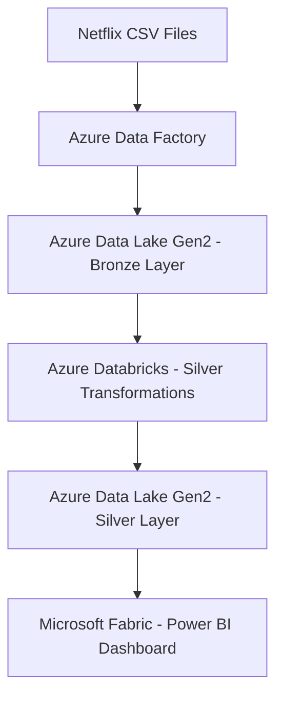

# 🎬 Netflix Watch Log — Azure Data Engineering Project

This is an **end-to-end Azure Data Engineering project** that processes and analyzes Netflix user activity data using various Azure services and Power BI for visualization. The purpose is to demonstrate a real-world data pipeline from raw data ingestion to insightful dashboards.
---

## 🚀 Project Architecture

